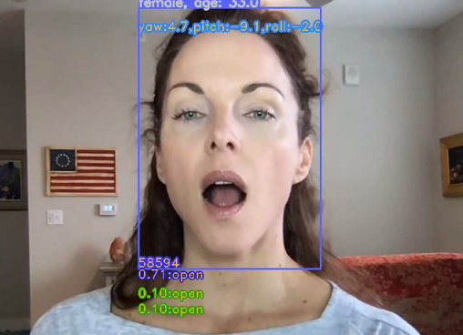
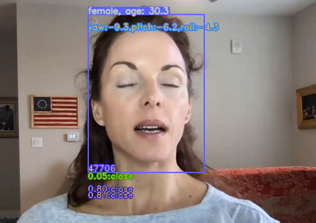

# face_multi_task
* 人脸多属性任务

## 项目介绍
* 人脸多任务,包括脸部 98 关键点，性别（男/女），年龄。
### 示例

## 项目配置
* 作者开发环境：
* Python 3.7
* PyTorch >= 1.5.1

## 数据集

* wiki_crop_face，并争对该项目进行制作，添加了人脸关键点标注信息。
* [数据集下载地址(百度网盘 Password: 3pjq )](https://pan.baidu.com/s/1i9fYkvt9wcZnsVGRckUnsg)

## 预训练模型
### 1、预训练模型
* [预训练模型下载地址(百度网盘 Password: brgk )](https://pan.baidu.com/s/1BVkJE-zH0Sf5Ojb12LZpvA)

## 项目使用方法
### 模型训练

* 根目录下运行命令： python train.py       (注意脚本内相关参数配置 )

### 模型推理
* 根目录下运行命令： python inference.py        (注意脚本内相关参数配置 )

## 联系方式 （Contact）
* 知识星球

* E-mails: 305141918@qq.com
